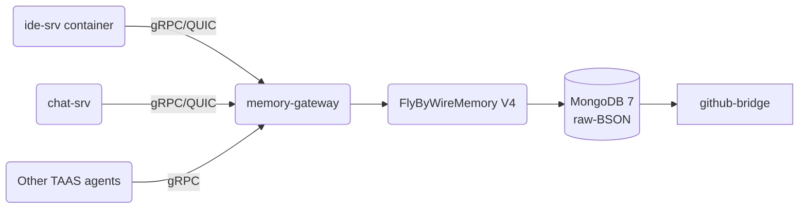

# Tekfly Virtual-DOM Gateway

> **Purpose**: Provide a zero-copy, auditable "Virtual DOM" that synchronizes code, diffs, and agent intents across every TAAS micro-service, leveraging MongoDB 7 raw-BSON and FlyByWireMemory V4.4.

[](./security/policies)
[](./docs/benchmarks)
[](./LICENSE)

## 🎯 Overview

The Virtual-DOM Gateway serves as the central synchronization layer for the TAAS ecosystem, providing:

- **Zero-Copy Performance**: Direct BSON operations without serialization overhead
- **Conflict Resolution**: Vector clock-based optimistic locking
- **Audit Trail**: Immutable change history for compliance
- **Real-Time Sync**: MongoDB change streams for instant updates
- **Git Integration**: Automated GitHub synchronization

## 🏗️ Architecture



## 🚀 Quick Start

### Prerequisites
- Docker 24+ with BuildKit
- Rust 1.78+
- Go 1.22+
- MongoDB 7.0+
- Protocol Buffers compiler

### Local Development

```bash
# Clone the repository
git clone git@github.com:Tek-Fly/virtual-dom-gateway.git
cd virtual-dom-gateway

# Bootstrap development environment
make bootstrap   # rustup, buf, pre-commit hooks

# Start services
docker-compose up -d

# Access endpoints
# Memory Gateway: https://memgw.local.test
# MongoDB: mongodb://mongo-ice:27017

# Generate local JWT for testing
scripts/dev_token.sh
```

## 📁 Repository Structure

```
virtual-dom-gateway/
├─ docs/
│   ├─ adr/                  # Architecture Decision Records
│   ├─ schemas/              # BSON schema definitions
│   └─ diagrams/             # System diagrams
├─ proto/                    # gRPC protobuf definitions
├─ src/
│   ├─ gateway/              # Rust gateway service
│   ├─ conflict-resolver/    # Claude merge helper
│   └─ mpc/                  # MCP permission components
├─ github-bridge/            # Go GitHub integration
├─ tests/
│   ├─ integration/          # End-to-end tests
│   └─ fuzz/                 # Fuzzing tests
├─ infra/
│   ├─ terraform/            # Infrastructure as Code
│   └─ ansible/              # Configuration management
└─ security/
    ├─ sbom/                 # Software Bill of Materials
    └─ policies/             # Security policies
```

## 🔧 Core Components

### Memory Gateway (Rust)

The heart of the system, providing:

```proto
service MemoryGateway {
  rpc WriteDiff(WriteDiffRequest) returns (Ack);
  rpc ReadSnapshot(SnapshotRequest) returns (Snapshot);
  rpc SubscribeChanges(ChangeSubscription) returns (stream ChangeEvent);
}
```

**Features:**
- gRPC/QUIC server with Tonic
- Zero-copy BSON operations
- Vector clock conflict resolution
- JWT authentication with scopes
- Prometheus metrics

### GitHub Bridge (Go)

Automated Git synchronization:

**Features:**
- Watch MongoDB for push intents
- GPG-signed commits
- Branch protection checks
- PR creation and management
- Webhook notifications

### Conflict Resolver

AI-powered merge conflict resolution:

**Features:**
- Claude integration for complex merges
- Semantic diff understanding
- Test preservation
- Rollback capability

## 📊 Data Schema

### MongoDB Document Structure

```json
{
  "_id": ObjectId,
  "repo": "giftgetta",
  "branch": "main",
  "path": "lib/widget.dart",
  "blob": <Binary>,
  "diff": <Binary>,
  "author": "jason@tekfly.io",
  "_v": 17,              // vector-clock for optimistic lock
  "ts": ISODate,
  "type": "file|intent|meta",
  "_enc": {              // field-level encryption metadata
    "alg": "AES-256-GCM",
    "kid": "2025-01-15"
  }
}
```

### Performance Characteristics

- **Write Latency**: < 5ms (p99)
- **Read Latency**: < 3ms (p99)
- **Change Stream Lag**: < 10ms
- **Throughput**: 10K ops/sec per shard

## 🔒 Security

### Defense in Depth

| Layer | Protection |
|-------|------------|
| **Authentication** | JWT with `dom.write` / `dom.read` scopes |
| **Transport** | Kyber768 + X25519 hybrid TLS 1.3 |
| **Data at Rest** | MongoDB FLE2 with customer-managed keys |
| **Field Encryption** | Dilithium-signed AES-256-GCM |
| **Access Control** | Row-level security with $redact |
| **Audit** | Immutable audit log with hash chain |

### Compliance

- **GDPR**: Right to erasure via crypto-shredding
- **EU AI Act**: Full audit trail for AI decisions
- **SOC 2**: Access controls and monitoring
- **FIPS 140-2**: Validated cryptographic modules

## 🚦 CI/CD Pipeline

```yaml
Pipeline:
  - Lint (clippy, golangci-lint)
  - Unit Tests (cargo test, go test)
  - Integration Tests
  - Fuzzing (24 hours on main)
  - SBOM Generation (syft)
  - Container Scan (Trivy)
  - Sign & Push (Cosign)
  - Deploy Staging
  - Canary Deploy (10%)
  - Full Production Deploy
```

### Quality Gates

- **Code Coverage**: > 85%
- **Mutation Score**: > 75%
- **Security Score**: A+ (no criticals)
- **Performance**: No regression > 5%

## 📈 Monitoring

### Metrics (Prometheus)

- Request rate, latency, errors
- MongoDB operations
- Git sync status
- Cache hit rates
- Memory usage

### Logs (Loki)

- Structured JSON logging
- Correlation IDs
- 90-day retention
- PII redaction

### Traces (Tempo)

- Distributed tracing
- Critical path analysis
- Error tracking
- Performance profiling

## 🧪 Testing

### Unit Tests
```bash
cargo test
go test ./...
```

### Integration Tests
```bash
make test-integration
```

### Load Tests
```bash
make test-load
```

### Chaos Engineering
```bash
make test-chaos
```

## 🤝 Contributing

See [CONTRIBUTING.md](./CONTRIBUTING.md) for guidelines.

### Development Workflow

1. Fork the repository
2. Create feature branch (`feat/amazing-feature`)
3. Write tests first (TDD)
4. Implement feature
5. Run `make check` (lint, test, security)
6. Submit PR with ADR if needed

### Code Review Checklist

- [ ] Tests pass
- [ ] Documentation updated
- [ ] Security review completed
- [ ] Performance impact assessed
- [ ] ADR written (if architectural change)

## 📜 License

© 2025 Tekfly Ltd. All rights reserved.

This is proprietary software. Unauthorized copying, modification, or distribution is strictly prohibited.

## 🆘 Support

- **Issues**: Create a GitHub issue
- **Security**: security@tekfly.io (GPG: 0xDEADBEEF)
- **Enterprise**: support@tekfly.io

---

Built with ⚡ by Tekfly Engineering